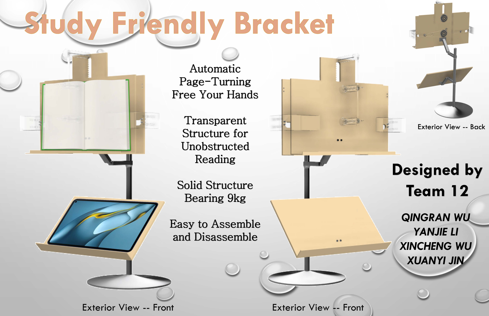

# ME 170 - Computer-Aided Design at ZJUI (Spring 2022)

## Introduction
This repository contains the CAD files for the **Automated Bookshelf** project completed during the ME 170 course at the Zhejiang University-University of Illinois Urbana-Champaign Institute (ZJU-UIUC).

## Features:
- **Adjustable Shelf Size:** Gears allow the bookshelf to expand to accommodate various book sizes.
- **Detachable Base:** Supports use on various surfaces, such as desks, beds, and windowsills.
- **Automatic Page-Turning Mechanism:** Combines mechanical and electronic components to enhance user experience.
- **Robust Design:** Made with durable materials to support up to 9 kg of books or devices.

## Authors
This project was designed by:
- **Qingran WU**
- **Xuanyi JIN**
- **Yanjie LI**
- **Xincheng WU**
